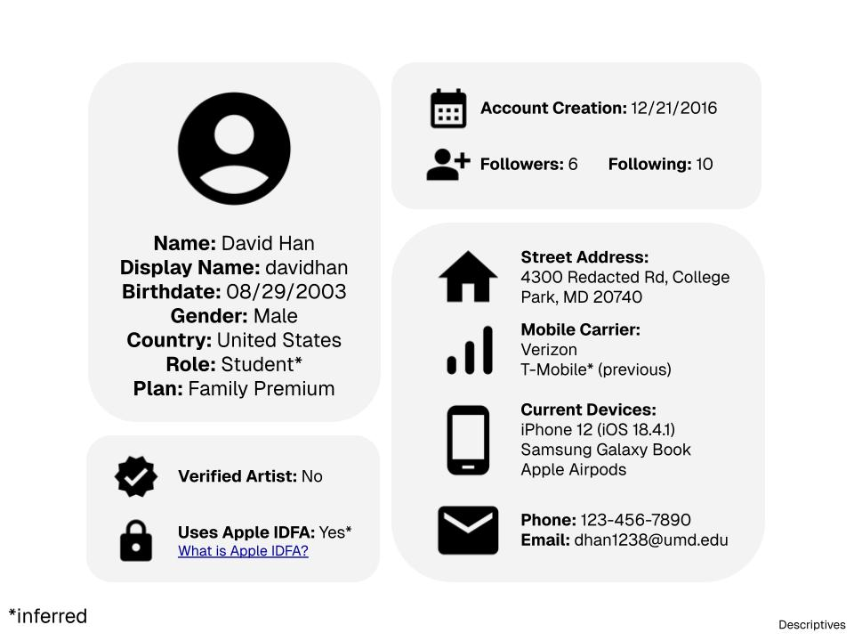
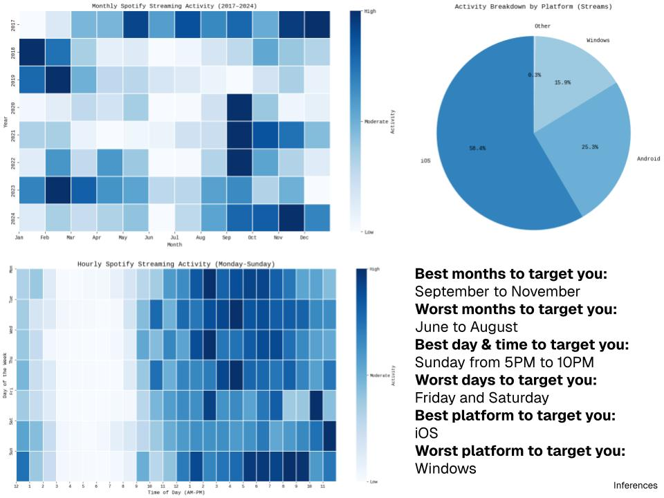
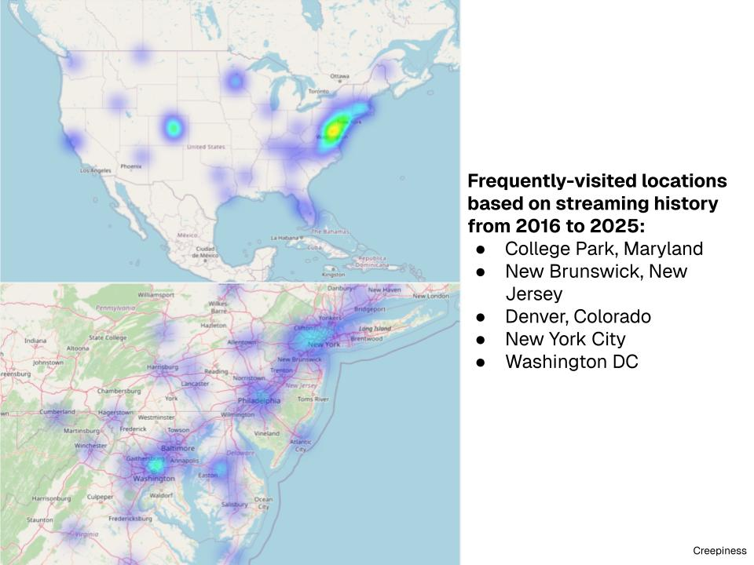

# my-spotify-data
Visualizing and calculating metrics from my Spotify data export using Python and Google Colab.

## Results

Visualizations were grouped into four different categories:

1. Descriptives: high-level information (e.g. name, location)
2. Engagement: platform usage (e.g. listening time, click counts)
3. Inferences: personal information inferred for advertising purposes
4. Sensitive: "creepy" or sensitive information collected by the platform

Code used to generate aggregate statistics and charts/graphs can be found in the analysis.ipynb notebook. 

